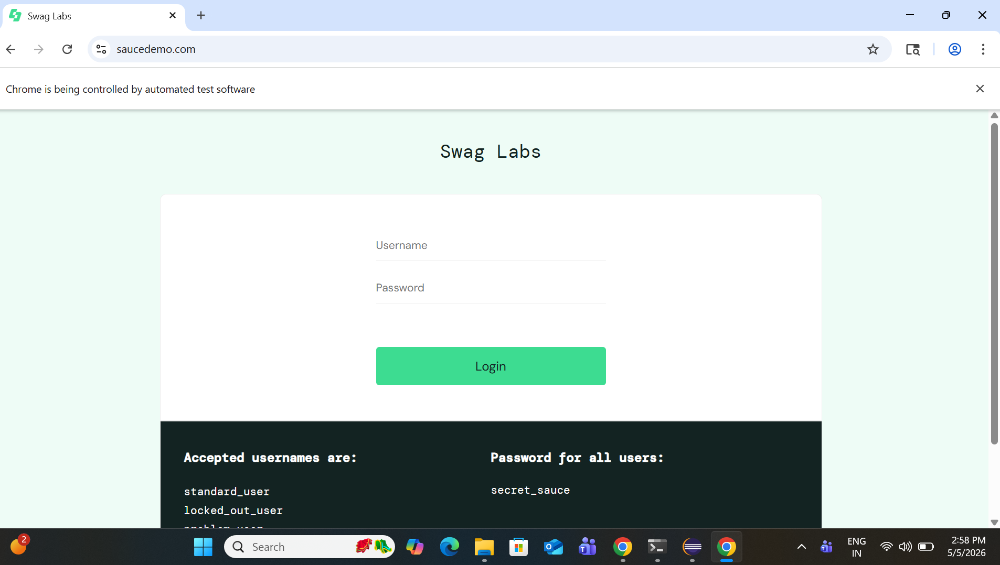

# 🛒 E-Commerce Automation Framework

## 📌 Project Overview

This project is an automated test framework developed for an e-commerce web application using Selenium. It simulates real user scenarios such as login, product selection, and cart validation.

The framework is built using industry-standard design patterns like Page Object Model (POM) for better maintainability and scalability.

---

## 🚀 Tech Stack

* Java
* Selenium WebDriver
* TestNG
* Maven

---

## 🧱 Framework Design

* **Page Object Model (POM)** for separation of concerns
* **Base Class** for driver initialization and teardown
* **Test Classes** for execution logic
* **Reusable methods** for scalability

---

## 📂 Project Structure

```
EcommerceAutomation/
│
├── src/test/java
│   ├── base        → Driver setup
│   ├── pages       → Page classes
│   ├── tests       → Test cases
│   └── utils       → Utilities (future use)
│
├── pom.xml
├── testng.xml
└── README.md
```

---

## ✅ Test Scenarios Covered

* Login with valid credentials
* Add product to cart
* Navigate to cart page

---

## ▶️ How to Run the Project

1. Clone the repository:

```
git clone https://github.com/YOUR_USERNAME/ecommerce-automation.git
```

2. Open in Eclipse or IntelliJ
3. Run `testng.xml`
   OR
   Run test class directly

---

## 📸 Test Execution Screenshots

### 🔐 Login Page

(Add screenshot here)

### 🛍️ Product Page

(Add screenshot here)

### 🛒 Cart Page

(Add screenshot here)

---

## 📊 Future Enhancements

* Add checkout automation
* Data-driven testing
* Reporting (Extent Reports / Allure)
* CI/CD integration

---

## 👨‍💻 Author

Your Name
GitHub: https://github.com/YOUR_USERNAME
🛒 E-Commerce Automation Framework
📌 Project Overview
This project is an automated test framework developed for an e-commerce web application using Selenium. It simulates real user scenarios such as login, product selection, and cart validation.

The framework is built using industry-standard design patterns like Page Object Model (POM) for better maintainability and scalability.

🚀 Tech Stack
Java
Selenium WebDriver
TestNG
Maven
🧱 Framework Design
Page Object Model (POM) for separation of concerns
Base Class for driver initialization and teardown
Test Classes for execution logic
Reusable methods for scalability
📂 Project Structure
EcommerceAutomation/
│
├── src/test/java
│   ├── base        → Driver setup
│   ├── pages       → Page classes
│   ├── tests       → Test cases
│   └── utils       → Utilities (future use)
│
├── pom.xml
├── testng.xml
└── README.md
✅ Test Scenarios Covered
Login with valid credentials
Add product to cart
Navigate to cart page
▶️ How to Run the Project
Clone the repository:
git clone https://github.com/YOUR_USERNAME/ecommerce-automation.git
Open in Eclipse or IntelliJ
Run testng.xml OR Run test class directly
📸 Test Execution Screenshots
🔐 Login Page
 


🛒 Cart Page
 
📊 Future Enhancements
Add checkout automation
Data-driven testing
Reporting (Extent Reports / Allure)
CI/CD integration
👨‍💻 Author
Your Name GitHub: https://github.com/Kishankasetty
🛒 E-Commerce Automation Framework
📌 Project Overview
This project is an automated test framework developed for an e-commerce web application using Selenium. It simulates real user scenarios such as login, product selection, and cart validation.

The framework is built using industry-standard design patterns like Page Object Model (POM) for better maintainability and scalability.

🚀 Tech Stack
Java
Selenium WebDriver
TestNG
Maven
🧱 Framework Design
Page Object Model (POM) for separation of concerns
Base Class for driver initialization and teardown
Test Classes for execution logic
Reusable methods for scalability
📂 Project Structure
EcommerceAutomation/
│
├── src/test/java
│   ├── base        → Driver setup
│   ├── pages       → Page classes
│   ├── tests       → Test cases
│   └── utils       → Utilities (future use)
│
├── pom.xml
├── testng.xml
└── README.md
✅ Test Scenarios Covered
Login with valid credentials
Add product to cart
Navigate to cart page
▶️ How to Run the Project
Clone the repository:
git clone https://github.com/YOUR_USERNAME/ecommerce-automation.git
Open in Eclipse or IntelliJ
Run testng.xml OR Run test class directly
📸 Test Execution Screenshots
🔐 Login Page
 


🛒 Cart Page
 
📊 Future Enhancements
Add checkout automation
Data-driven testing
Reporting (Extent Reports / Allure)
CI/CD integration
👨‍💻 Author
Your Name GitHub: https://github.com/Kishankasetty
git clone https://github.com/Kishankasetty /ecommerce-automation.git